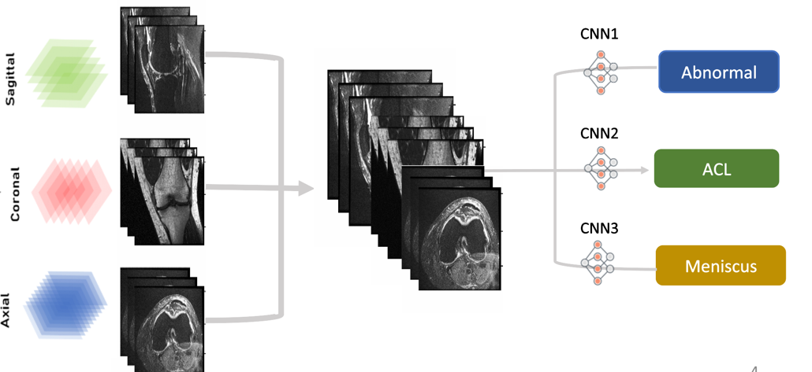
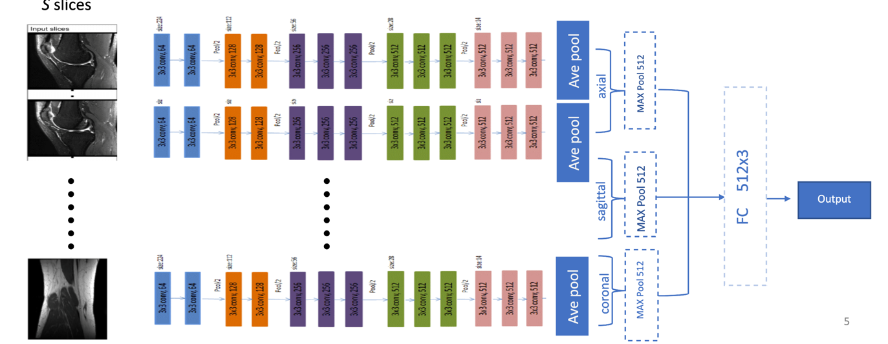

# Diagnosis of Knee Injuries From Magnetic Resonance Imaging(MRI) Using Deep Learning Techniques


>**Abstract:**<div style="text-align: justify"> Magnetic resonance imaging (MRI) is widely utilized for the diagnosis of knee injuries. The results from the diagnosis imaging technique is then used to determine the severity of knee injury; the type of knee injury as well as the most appropriate treatment plan of care. With deep learning, the algorithm allows for the prediction of abnormalities present in the MRI examinations. This becomes significant when considering a major "con" known with MRI being used for knee injury diagnosis. Radiologists and surgeons are responsible for evaluating these knee disorder along with other musculoskeletal exams, with specific focus on anterior cruciate ligament (ACL) tears and meniscal tears for this report.  The importance of the deep learning in this evaluation lies in the goal to improve the prediction of abnormalities, which in turn enables the medical personnel to prescribe a more accurate and suitable plan of care for the injured individual. All of this is done through deep learning through learning layers of features and modeling complex relationships between the medical images acquired and their interpretation.</div>

## Description
<div style="text-align: justify">

- The model consisted of convolutional neural networks that takes the input of the MRI  and outputs a classification prediction. 

- For each scan, there are three series of slices(i.e. Images with dimension 3x256x256) corresponding to three different planes( sagittal, coronal and axial).
- The input has dimensions s x 3 x 256 x 256 where s is the total number of slices from three planes in the MRI scan. 3 is number of color channel per slice.

- For each of these three injury types, we trained a network to identify these different keen injuries.

`Overal Methodology:`



`Convolutional Neural Network Architecture:`




</div>

## Data  
<div style="text-align: justify">
The MRNet dataset consists of 1,370 knee MRI exams performed at Stanford University Medical Center. The dataset contains 1,104 (80.6%) abnormal exams, with 319 (23.3%) ACL tears and 508 (37.1%) meniscal tears; labels were obtained through manual extraction from clinical reports.

The data needs to be accessed using the  [MRnet](https://stanfordmlgroup.github.io/competitions/mrnet/) request form and can be downloaded from [here](https://stanfordmlgroup.github.io/competitions/mrnet/).
After downloading the data, it should be extracted and placed in the`images` folder.
```Shell
  images/
      train/
          axial/
          sagittal/
          coronal/
      val/
          axial/
          sagittal/
          coronal/
      train-abnormal.csv
      train-acl.csv
      train-meniscus.csv
      valid-abnormal.csv
      valid-acl.csv
      valid-meniscus.csv
``` 
</div>

## Setup  
The required dependencies are listed in "requirements.txt". To install the dependencies run the following command:
  ```shell script
pip install -r  requirements.txt
```


#### Training
- The main training script is placed in `train.py`.
- Training arguments can be found at `config.py`.
- Intermediate training results are saved to config.out_dir. 
Additionally, if you have wandb account, you can visualize create a project to monitor the training logs.
For this purpose `WANDB_API_KEY` needs to be specified in `config.py`


## Related Works

MRNet: Deep-learning-assisted diagnosis for knee magnetic resonance imaging(https://stanfordmlgroup.github.io/projects/mrnet/) (Bien et al).

